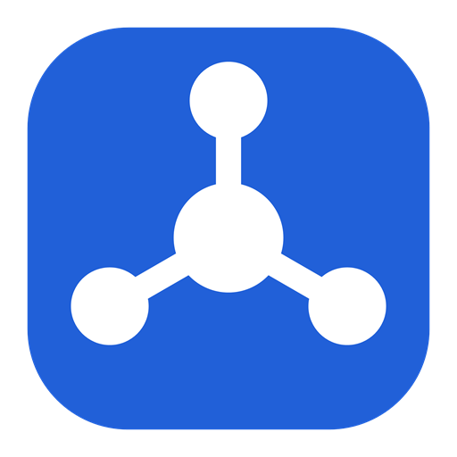

<p align="center">
  
</p>

<h1 align="center">NexusWorkspace</h1>

<p align="center">
  Espacio de trabajo técnico personal — <b>local-first</b> y offline, para Windows.<br/>
  Centraliza proyectos, tareas, personas, empresas, comunicaciones y documentación,
  <b>conservando todo el histórico de forma permanente e inmutable</b>.
</p>

<p align="center">
  <a href="https://github.com/porrii/NexusWorkspace/actions/workflows/build.yml"></a>
  
  
  
  
</p>

> **Principio:** *nunca perder información.* Una tarea, incidencia o proyecto finalizado no
> desaparece — se archiva y permanece localizable durante años.

---

## Qué hace

- **Proyectos y tareas** con estados, prioridades, fechas, responsable y empresa; **subtareas**
  editables desde la propia tarea o desplegables en línea desde la página **Tareas**; **comentarios**;
  **etiquetas** transversales.
- **Recordatorios** con fecha y hora, notificaciones locales y **repetición** (diaria, semanal o
  mensual, cada N, con fin opcional) — se crean también con un clic desde cualquier día del
  Calendario.
- **Personas y empresas** con su histórico agregado; vínculos a proyectos y tareas; empleador.
- **Comunicaciones** (email, llamada, reunión…) y **reuniones**, enlazadas a la persona, la
  empresa, el proyecto y la tarea a la vez.
- **Registrar evento**: hitos de un clic en una tarea (incidencia, despliegue, prueba…), con
  tipos que defines tú.
- **Vistas**: Dashboard con "¿qué tengo hoy?", Kanban por proyecto, Calendario, página global de
  **Tareas** con filtros, **Actividad** filtrable y agrupada por día, **Archivos** adjuntos.
- **Informes** PDF/Excel/CSV/JSON, **plantillas** de proyecto/tarea, **importación** JSON/CSV y
  de notas indentadas.
- **Copias de seguridad** automáticas y antes de cada migración; exportar/importar el workspace.
- **Captura rápida** con hotkey global, **paleta de comandos** (Ctrl+K) y **búsqueda** FTS5 (Ctrl+F).

100 % offline. Sin cuenta. Sin nube.

## Instalación

Descarga `NexusWorkspace-win-Setup.exe` de la página de
[**Releases**](https://github.com/porrii/NexusWorkspace/releases) y ejecútalo. No requiere
prerrequisitos (incluye el runtime de .NET 9). Al actualizar o reinstalar **no se tocan tus
datos** (`%APPDATA%\NexusWorkspace\`).

> Windows puede mostrar un aviso de SmartScreen la primera vez (el ejecutable no está firmado
> con un certificado de pago) — "Más información" → "Ejecutar de todas formas".

## Compilar

```bat
build.bat                :: restaura + compila Debug + tests
build.bat run notest     :: compila y lanza la app
build.bat installer       :: build Release + instalador Velopack (installer\releases\)
build.bat portable        :: build Release + zip portable
```

`build.bat` resuelve un .NET 9 SDK compatible por sí mismo (usa el del equipo o instala una
copia privada en `.dotnet\`, sin admin). Detalles: [`docs/BUILD.md`](docs/BUILD.md).

## Documentación

| Documento | Contenido |
|---|---|
| [`docs/ARCHITECTURE.md`](docs/ARCHITECTURE.md) | Arquitectura por capas, almacenamiento, historial, backups, multiplataforma |
| [`docs/DATA-MODEL.md`](docs/DATA-MODEL.md) | Entidades, relaciones, enums, búsqueda FTS5 |
| [`docs/BUILD.md`](docs/BUILD.md) | Requisitos y comandos de compilación / publicación |
| [`docs/UX-REVIEW.md`](docs/UX-REVIEW.md) | Revisión de coherencia de UX y plan de bloques A–H |
| [`docs/RELEASE.md`](docs/RELEASE.md) | Lista de comprobación de la v1 |
| [`docs/ROADMAP.md`](docs/ROADMAP.md) | Fases de implementación |
| [`installer/README.md`](installer/README.md) | Cómo se genera el instalador |

## Tecnología

C# · .NET 9 · Avalonia 11 (MVVM, CommunityToolkit.Mvvm) · SQLite + EF Core 9 (FTS5) ·
FluentAvalonia · Material.Icons · Serilog · LiveCharts2 · QuestPDF · ClosedXML · Velopack · xUnit.

## Licencia

[MIT](LICENSE) © 2026 Iván.
